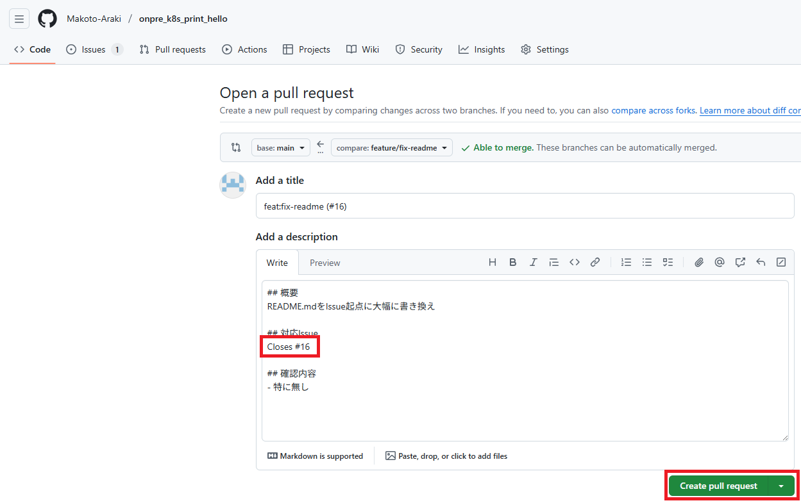
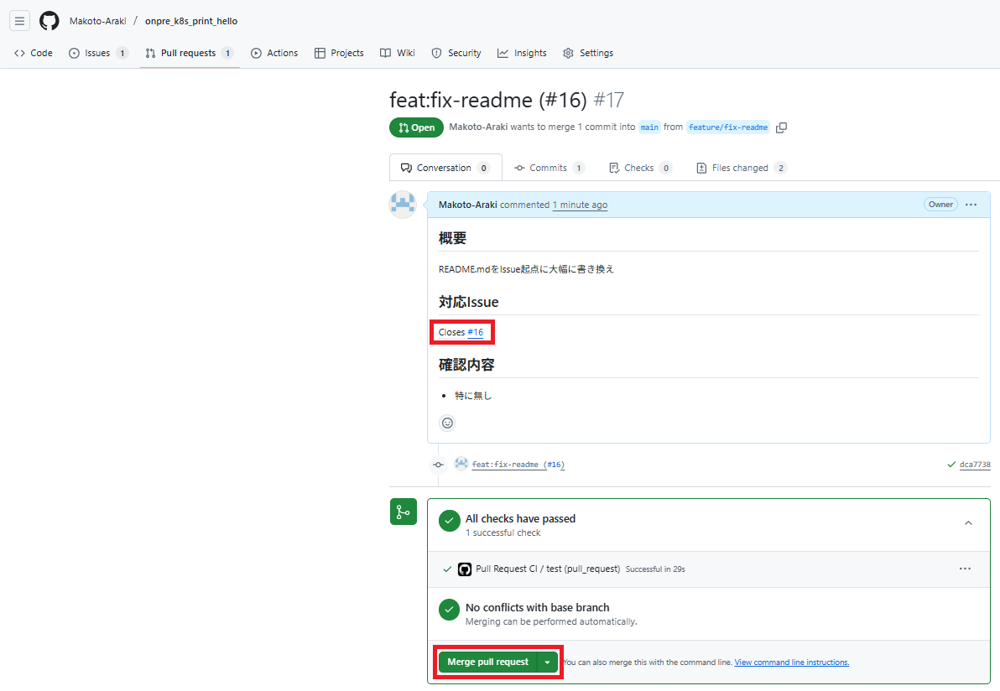
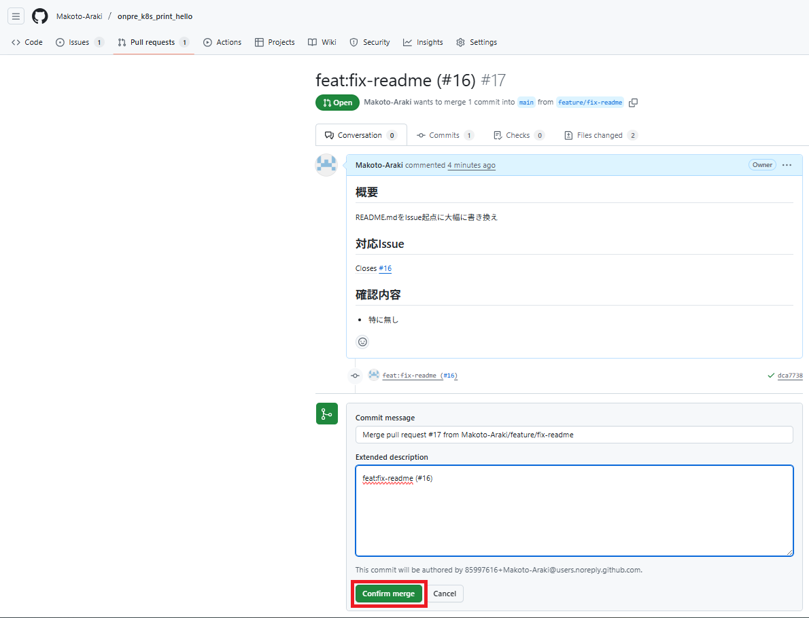
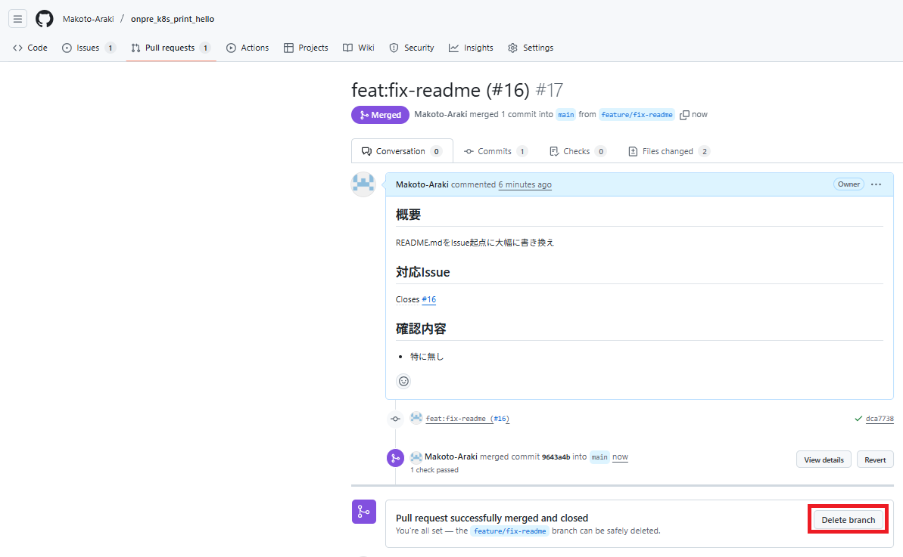
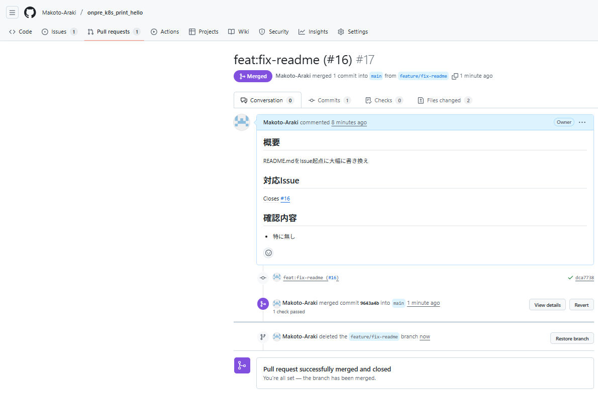

# onpre_k8s_print_hello (バッチ処理)

## 前提条件
- Dockerhubにアカウント作成済
- Dockerhubにpython_base_imageのDockerイメージリリース済
- DockerhubにPersonal-Access-Token (PTA) 作成済
- Docker-DesktopがWindows11のローカルPC上で起動済
- Docker-DesktopでDockerhubにログイン済
- Githubにアカウント作成済
- Githubにonpre_k8s_print_helloのリモートリポジトリ作成済
- Githubのonpre_k8s_print_helloのリモートリポジトリにSecrets登録済

## プログラム開発
- ローカルリポジトリ上で開発準備
- 標準出力にHelloとプリントする単純なバッチ処理の動作確認
- DockerHubにアップロード
- Docker-Desktop上の設定確認1
- Docker-Desktop上の設定確認2
- Kubectlの準備
- Docker-Desktop上のKubernetesクラスタで動作確認

## CI改善
- Githb-Actionsを使用したCI改善

## プログラム保守
- GithubでIssue作成
- 別ブランチ上で開発作業
- GithubでPR作成1
- GithubでPR作成2
- Githubでマージ1
- Githubでマージ2
- Githubの別ブランチをマージ後に削除1
- Githubの別ブランチをマージ後に削除2
- Githubからmainブランチをプル
- リリース1
- リリース2
- GithubとKubernetesの手動同期

## プログラム開発
### ローカルリポジトリ上で開発準備
```bash
## ディレクトリ作成
$ cd ~
$ mkdir onpre_k8s_print_hello

## ローカルリポジトリ初期化
$ cd ~/onpre_k8s_print_hello
$ git init

## ローカルリポジトリ設定 
$ git config --global user.email (自分のメールアドレス)
$ git config --global user.name Makoto-Araki

## ローカルリポジトリ設定
$ cd ~/onpre_k8s_print_hello
$ git branch -M main

## リモートリポジトリ設定
$ cd ~/onpre_k8s_print_hello
$ git remote add origin git@github.com:Makoto-Araki/onpre_k8s_print_hello.git

## 開発イメージ用のDockerfile作成
$ cd ~/onpre_k8s_print_hello
$ vi Dockerfile

## バッチ処理のプログラム用ディレクトリ作成
$ cd ~/onpre_k8s_print_hello
$ mkdir src

## バッチ処理のプログラム作成
$ cd ~/onpre_k8s_print_hello
$ vi src/main.py

## バッチ処理のテスト用ディレクトリ作成
$ cd ~/onpre_k8s_print_hello
$ mkdir tests

## バッチ処理のテスト用プログラム作成
$ cd ~/onpre_k8s_print_hello
$ vi tests/test_main.py

## 開発コンテナのディレクトリ作成
$ cd ~/onpre_k8s_print_hello
$ mkdir .devcontainer

## 開発コンテナの設定ファイル作成
$ cd ~/onpre_k8s_print_hello
$ vi .devcontainer/devcontainer.json

## VSCode用のディレクトリ作成
$ cd ~/onpre_k8s_print_hello
$ mkdir .vscode

## VSCode用の設定ファイル作成
$ cd ~/onpre_k8s_print_hello
$ vi .vscode/settings.json

## 開発イメージビルド
$ cd ~/onpre_k8s_print_hello
$ docker build --no-cache -t onpre_k8s_print_hello_image .

## 開発イメージからVSCode上で開発コンテナ起動
$ cd ~/onpre_k8s_print_hello
$ code .
```

### 標準出力にHelloとプリントする単純なバッチ処理の動作確認
```bash
## 開発コンテナ上のターミナルでバッチ処理の動作確認
$ cd ~
$ python src/main.py

## 開発コンテナ上のターミナルでバッチ処理のテスト
$ cd ~
$ python -m pytest tests/test_main.py
```

### DockerHubにアップロード
```bash
## DockerHubのイメージビルド
$ cd ~/onpre_k8s_print_hello
$ docker build --no-cache -t makotoaraki346/onpre_k8s_print_hello_image .

## DockerHubにアップロード
$ cd ~/onpre_k8s_print_hello
$ docker push makotoaraki346/onpre_k8s_print_hello_image
```

### Docker-Desktop上の設定確認1
```note
Settings > Resources > WSL Integration => Ubuntu スイッチON
```

### Docker-Desktop上の設定確認2
```note
Settings > Kubernetes => Enable Kubernetes スイッチON
```

### Kubectlの準備
```bash
## kubectlバイナリのダウンロード
$ cd ~/onpre_k8s_print_hello
$ curl -LO "https://dl.k8s.io/release/$(curl -L -s https://dl.k8s.io/release/stable.txt)/bin/linux/amd64/kubectl"

## kubectlバイナリに権限付与
$ cd ~/onpre_k8s_print_hello
$ sudo install -o root -g root -m 0755 kubectl /usr/local/bin/kubectl

## インストール確認
$ cd ~/onpre_k8s_print_hello
$ kubectl version --client

## ダウンロードしたkubectlバイナリ削除
$ cd ~/onpre_k8s_print_hello
$ rm kubectl

## 既存の設定ファイル削除
$ cd ~/.kube
$ mv config config_old

## Windows11側で起動しているDocker-Desktop上の設定ファイルへのリンク作成
$ cd ~/.kube
$ ln -s /mnt/c/Users/(Windows側のユーザー名)/.kube/config config

## コンテキスト一覧
$ cd ~/onpre_k8s_print_hello
$ kubectl config get-contexts

## コンテキスト確認
$ cd ~/onpre_k8s_print_hello
$ kubectl config current-context

## コンテキスト切替 ※コンテキスト切替時に実行
$ cd ~/onpre_k8s_print_hello
$ kubectl config use-context (コンテキスト名)
```

### Docker-Desktop上のKubernetesクラスタで動作確認
```bash
## コンテキスト一覧
$ cd ~/onpre_k8s_print_hello
$ kubectl config get-contexts

## コンテキスト確認
$ cd ~/onpre_k8s_print_hello
$ kubectl config current-context

## 名前空間一覧
$ cd ~/onpre_k8s_print_hello
$ kubectl get namespaces

## 名前空間作成
$ cd ~/onpre_k8s_print_hello
$ kubectl create namespace user-apps

## Cronjobリソース用のYAMLファイル作成
$ cd ~/onpre_k8s_print_hello
$ vi onpre_k8s_print_hello.yaml

## Cronjobリソース差分表示
$ cd ~/onpre_k8s_print_hello
$ kubectl diff -n user-apps -f onpre_k8s_print_hello.yaml

## Cronjobリソース作成または更新
$ cd ~/onpre_k8s_print_hello
$ kubectl apply -n user-apps -f onpre_k8s_print_hello.yaml

## Cronjobリソース確認
$ cd ~/onpre_k8s_print_hello
$ kubectl -n user-apps get cronjobs 

## Cronjobリソース動作確認1
$ cd ~/onpre_k8s_print_hello
$ kubectl -n user-apps get jobs ※Cronjobから起動されたJob名を確認

## Cronjobリソース動作確認2
$ cd ~/onpre_k8s_print_hello
$ kubectl -n user-apps get pods --selector=job-name=(取得したJob名) ※Jobから起動されたPod名を確認

## Cronjobリソース動作確認3
$ cd ~/onpre_k8s_print_hello
$ kubectl -n user-apps logs (取得したPod名) ※PodのログからHelloを確認
```

## CI改善
### Githb-Actionsを使用したCI改善
```bash
## Github-Actions用のディレクトリ作成
$ cd ~/onpre_k8s_print_hello
$ mkdir -p .github/workflows

## Github-Actions用のYAML作成1
$ cd ~/onpre_k8s_print_hello
$ vi .github/workflows/pull_request_ci.yml

## Github-Actions用のYAML作成2
$ cd ~/onpre_k8s_print_hello
$ vi .github/workflows/main_ci.yml

## Github-Actions用のYAML作成3
$ cd ~/onpre_k8s_print_hello
$ vi .github/workflows/release.yml

## Github-Actions用のYAMLプッシュ1
$ cd ~/onpre_k8s_print_hello
$ git add .

## Github-Actions用のYAMLプッシュ2
$ cd ~/onpre_k8s_print_hello
$ git commit -m Github-Actions用YAMLプッシュ

## Github-Actions用のYAMLプッシュ3
$ cd ~/onpre_k8s_print_hello
$ git push origin main
```

## CD改善
### Argo-CD本体
```bash
## Kubernetesクラスタにnamespace作成
$ cd ~/onpre_k8s_print_hello
$ kubectl create namespace argocd

## Argo-CD本体
$ cd ~/onpre_k8s_print_hello
$ kubectl apply -n argocd -f https://raw.githubusercontent.com/argoproj/argo-cd/stable/manifests/install.yaml

## Argo-CD本体のPod群の状態がRunningか確認
$ cd ~/onpre_k8s_print_hello
$ kubectl get pods -n argocd

## Argo-CD本体のログインパスワード取得
$ cd ~/onpre_k8s_print_hello
$ kubectl get secret argocd-initial-admin-secret -n argocd -o jsonpath="{.data.password}" | base64 -d

## Argo-CD本体の接続設定
$ cd ~/onpre_k8s_print_hello
$ kubectl port-forward svc/argocd-server -n argocd 8080:443
```

### Argo-CD-CLIを導入 ※別ターミナルで実行
```bash
## Argo-CD-CLIのダウンロード
$ cd ~/onpre_k8s_print_hello
$ curl -LO https://github.com/argoproj/argo-cd/releases/latest/download/argocd-linux-amd64

## Argo-CD-CLIに実行権限付与
$ cd ~/onpre_k8s_print_hello
$ chmod +x argocd-linux-amd64

## システムディレクトリに移動
$ cd ~/onpre_k8s_print_hello
$ sudo mv argocd-linux-amd64 /usr/local/bin/argocd

## Argo-CD-CLIのコマンド確認
$ cd ~/onpre_k8s_print_hello
$ argocd version

## Argo-CD本体にログイン
$ cd ~/onpre_k8s_print_hello
$ argocd login localhost:8080 # 認証情報は「admin/上記のログインパスワード」

## Argo-CD本体にアプリ登録
$ cd ~/onpre_k8s_print_hello
$ argocd app create onpre-k8s-print-hello \
    --repo https://github.com/Makoto-Araki/onpre_k8s_print_hello.git \
    --path . \  # YAMLファイルの存在する場所
    --dest-server https://kubernetes.default.svc \  # Kubernetesクラスタ名(固定)
    --dest-namespace user-apps  # Kubernetesクラスタのnamespace名

## Argo-CD本体のアプリ一覧
$ cd ~/onpre_k8s_print_hello
$ argocd app list

## Argo-CD本体のアプリ詳細
$ cd ~/onpre_k8s_print_hello
$ argocd app get onpre-k8s-print-hello

## Argo-CD本体のアプリ手動同期
$ cd ~/onpre_k8s_print_hello
$ argocd app sync onpre-k8s-print-hello  # GitのYAML内容がKubernetesクラスタに反映

## Argo-CD本体のアプリ詳細
$ cd ~/onpre_k8s_print_hello
$ argocd app get onpre-k8s-print-hello

## Argo-CD本体からログアウト
$ cd ~/onpre_k8s_print_hello
$ argocd logout
```

## プログラム保守
### GithubでIssue作成


### 別ブランチ上で開発作業
```bash
## ブランチ一覧
$ cd ~/onpre_k8s_print_hello
$ git branch

## 別ブランチ作成
$ cd ~/onpre_k8s_print_hello
$ git checkout -b feature/fix-source

## 別ブランチをGithub上に作成
$ cd ~/onpre_k8s_print_hello
$ git push -u origin feature/fix-source

## 別ブランチ上で開発1
$ cd ~/onpre_k8s_print_hello
$ vi src/main.py

## 別ブランチ上で開発2
$ cd ~/onpre_k8s_print_hello
$ vi tests/test_main.py

## Cronjobリソース用のYAML更新
$ cd ~/onpre_k8s_print_hello
$ vi onpre_k8s_print_hello.yaml

## 別ブランチ上の変更ファイル確認
$ cd ~/onpre_k8s_print_hello
$ git status

## 別ブランチ上の変更ファイル差分
$ cd ~/onpre_k8s_print_hello
$ git diff

## 別ブランチ上の変更ファイルをステージング移行
$ cd ~/onpre_k8s_print_hello
$ git add .

## 別ブランチ上の変更ファイルをコミット ※#16はIssue番号
$ cd ~/onpre_k8s_print_hello
$ git commit -m 'feat:fix-source (#16)'

## ブランチ上の変更ファイルを対象ブランチにプッシュ
$ cd ~/onpre_k8s_print_hello
$ git push origin feature/fix-source
```

### GithubでPR作成1


### GithubでPR作成2


```note
PR作成後にGithub-Actionsのpull_request_ci.ymlが実行される。
```

### Githubでマージ1


### Githubでマージ2


```note
マージ後にGithub-Actionsのmain_ci.ymlが実行され、mainブランチが最新の状態になる。
```

### Githubの別ブランチをマージ後に削除1


### Githubの別ブランチをマージ後に削除2


```note
マージ後に別ブランチ削除を行い不要ブランチは持たない。
```

### Githubからmainブランチをプル
```bash
## ブランチ確認
$ cd ~/onpre_k8s_print_hello
$ git branch

## ブランチをmainブランチに戻す
$ cd ~/onpre_k8s_print_hello
$ git checkout main

## Github上のmainブランチの内容をプル
$ cd ~/onpre_k8s_print_hello
$ git pull origin main

## 別ブランチを削除
$ cd ~/onpre_k8s_print_hello
$ git branch -d feature/fix-source
```

### リリース1
```bash
## タグ付与
$ cd ~/onpre_k8s_print_hello
$ git tag vX.Y.Z

## リリース
$ cd ~/onpre_k8s_print_hello
$ git push origin main vX.Y.Z
```

### リリース2
```note
マージ後にGithub-Actionsのrelease.ymlが実行され、DockerHubに指定タグでDockerイメージ更新。
```

### GithubとKubernetesの手動同期
```bash
## Argo-CD本体にログイン
$ cd ~/onpre_k8s_print_hello
$ argocd login localhost:8080 # 認証情報は「admin/上記のログインパスワード」

## Argo-CD本体のアプリ一覧
$ cd ~/onpre_k8s_print_hello
$ argocd app list

## Argo-CD本体のアプリ詳細
$ cd ~/onpre_k8s_print_hello
$ argocd app get onpre-k8s-print-hello

## Argo-CD本体のアプリ手動同期
$ cd ~/onpre_k8s_print_hello
$ argocd app sync onpre-k8s-print-hello  # GitのYAML内容がKubernetesクラスタに反映

## Argo-CD本体のアプリ詳細
$ cd ~/onpre_k8s_print_hello
$ argocd app get onpre-k8s-print-hello

## Argo-CD本体からログアウト
$ cd ~/onpre_k8s_print_hello
$ argocd logout

## Cronjobリソース確認
$ cd ~/onpre_k8s_print_hello
$ kubectl -n user-apps get cronjobs 

## Cronjobリソース動作確認1
$ cd ~/onpre_k8s_print_hello
$ kubectl -n user-apps get jobs ※Cronjobから起動されたJob名を確認

## Cronjobリソース動作確認2
$ cd ~/onpre_k8s_print_hello
$ kubectl -n user-apps get pods --selector=job-name=(取得したJob名)

## Cronjobリソース動作確認3
$ cd ~/onpre_k8s_print_hello
$ kubectl -n user-apps logs (取得したPod名)
```
